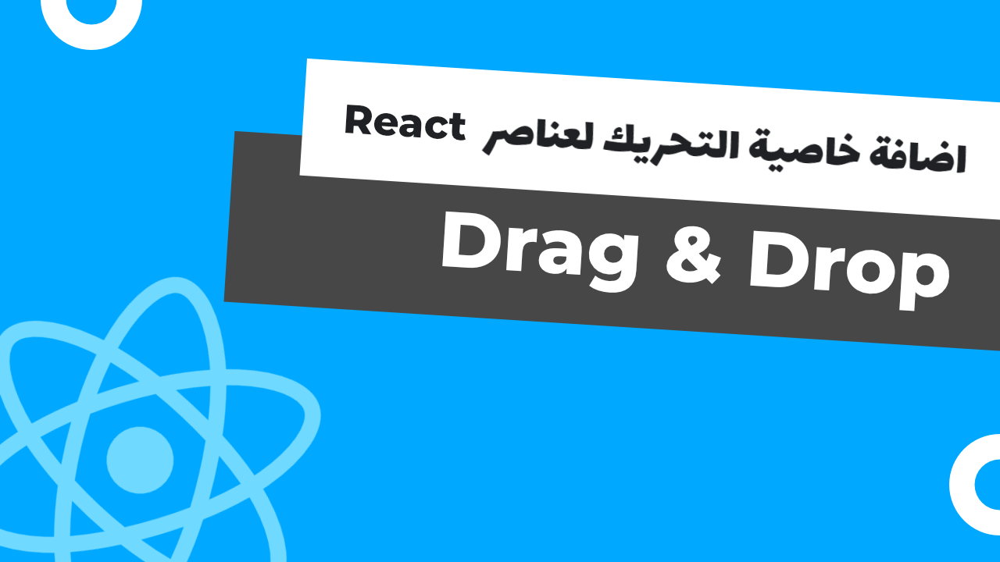
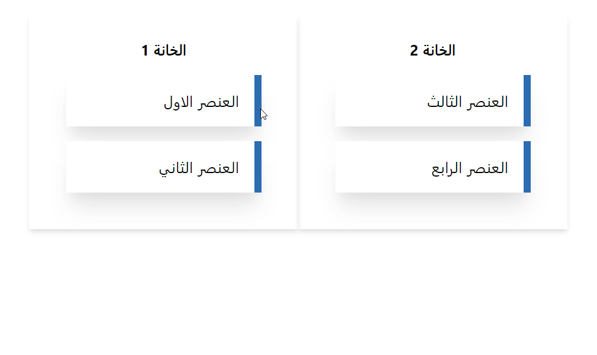
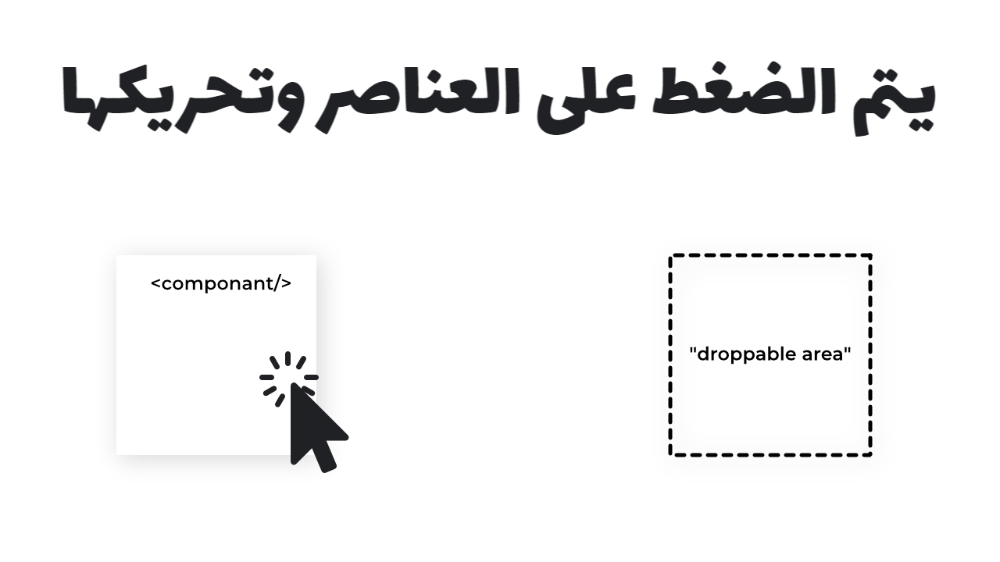
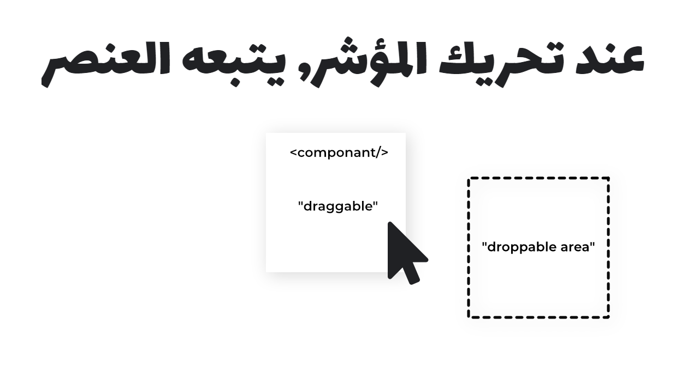
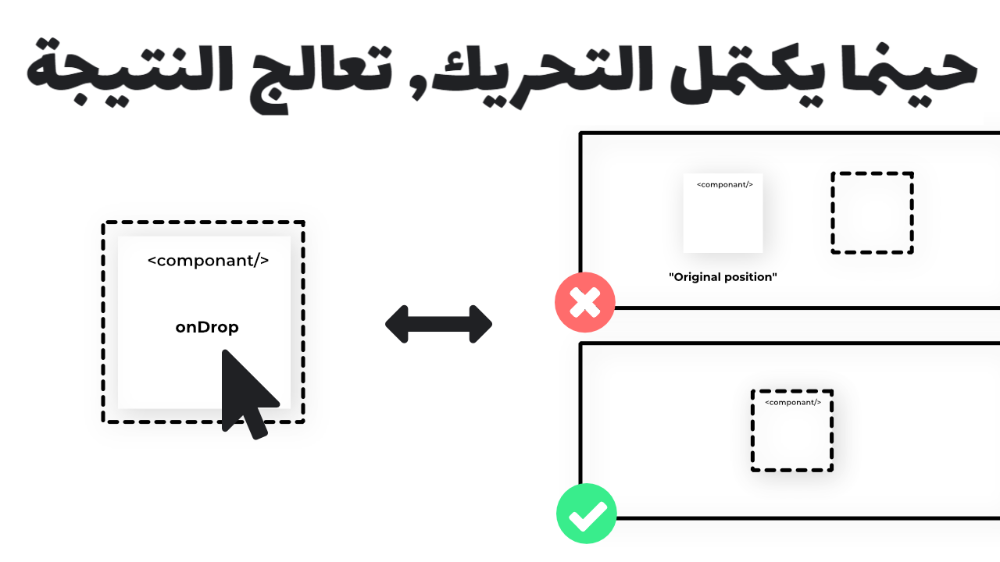

# <div dir="rtl">عن المشروع</div>

###### <div dir="rtl">هذا المشروع يهدف بالاساس لشرح كيفية جعل عناصر React قابلة للسحب و التحريك (Drag & Drop) مباشرة عن طريق DOM Event Model</div>

###### <div dir="rtl">اذا كنت تريد أن تعرف أكثر عن كيف يتم ذلك, انصحك ان تراجع الرابط التالي: </div>

###### <div dir="rtl">[HTML Drag'n Drop API](https://developer.mozilla.org/en-US/docs/Web/API/HTML_Drag_and_Drop_API)</div>

# <div dir="rtl">الهدف</div>

###### <div dir="rtl">يسرني أنك قد سئلت, هناك العديد من الاستخدامات للعناصر القابلة للتحريك التي يمكن ان تسهل التعامل مع واجهة المستخدم (UI)</div>

###### <div dir="rtl">من هذه الناحية خصوصا في البرامج التعليمية او أي حلول تعتمد بشكل كبير على تجاوب المستخدم . بعض الامثلة الحية:</div>

###### <div dir="rtl">[DrawMuzz](https://drawmuzz.web.app/), [Trello Boards](https://trello.com/), [Google Calendar Scheduler](https://calendar.google.com/)</div>

# <div dir="rtl">النتيجة النهائية</div>




###### <div dir="rtl">رابط للتجريب: [https://qalamar.github.io/react-dnd-showcase](https://qalamar.github.io/react-dnd-showcase)</div>

---

# <div dir="rtl">كيف يعمل المشروع</div>






---

# <div dir="rtl">متطلبات</div>

###### <div dir="rtl">للقيام بتشغيل وصنع المثال, نحتاج أولا الى تنفيذ بعض الاوامر:</div>

```javascript
npx create-react-app react-dnd
cd react-dnd
npm start
```

###### <div dir="rtl">اذا كنت تستعمل Yarn

</div>

```javascript
yarn create react-app react-dnd
cd react-dnd
yarn start
```

---

# <div dir="rtl">تعليمات</div>

###### <div dir="rtl">توجه الى ملف `App.js`</div>

##### <div dir="rtl">تخزين المعلومات:</div>

###### <div dir="rtl">لنقم بانشاء جدول يضم معلومات حول العناصر</div>

```javascript
const [state, setState] = useState({
  items: [
    {
      id: "1",
      item: "العنصر الاول",
      type: "Slot1",
    },
    {
      id: "2",
      item: "العنصر الثاني",
      type: "Slot1",
    },
    {
      id: "3",
      item: "العنصر الثالث",
      type: "Slot2",
    },
    {
      id: "4",
      item: "العنصر الرابع",
      type: "Slot2",
    },
  ],
});
```

##### <div dir="rtl">معالجة التحريك (Event handlers):</div>

###### <div dir="rtl">حينما نضغط على العنصر, نقوم بنقل المعلومات مؤقتا</div>

```javascript
const onDragStart = (event, item) => {
  event.dataTransfer.setData("item", item);
};
```

###### <div dir="rtl">نمنع المعالجة الافتراضية لأننا نريد تطبيق معالجة خاصة</div>

```javascript
const onDragOver = (event) => {
  event.preventDefault();
};
```

###### <div dir="rtl">عند وضع العنصر داخل الاطار, نقوم بتحويل المعلومات المعدة سابقا في `OnDragStart`</div>

###### <div dir="rtl">ونقوم بالتأكد بأن العنصر في الاطار المناسب. بعدها نقوم بتحديث الـstate بالحالة الجديدة</div>

```javascript
const onDrop = (event, slot) => {
  let item = event.dataTransfer.getData("item");
  let items = state.items.filter((task) => {
    if (task.item === item) {
      task.type = slot;
    }
    return task;
  });
  setState({
    ...state,
    items,
  });
};
```

###### <div dir="rtl">عند حدوث تحريك, نقوم بتحديث جداول الخانات في حالة اضافة عناصر جديدة</div>

###### <div dir="rtl">`لا تنسى ان تضيف "dir="rtl الى عناصرك اذا كنت تستخدم اللغة العربية`</div>

```javascript
state.items.forEach((task) => {
  items[task.type].push(
    <div
      key={task.id}
      onDragStart={(event) => onDragStart(event, task.item)}
      draggable
      dir="rtl"
    >
      {task.item}
    </div>
  );
});
```

###### <div dir="rtl">في واجهة المستخدم, نقوم بصنع خانتين. كل منهما تعرض العناصر المطابقة لنوعها</div>

```javascript
<div>
  <h1 dir="rtl">يمكنك سحب العناصر من خانة الى اخرى (Drag & Drop)</h1>
  <div>
    <div
      onDragOver={(event) => onDragOver(event)}
      onDrop={(event) => onDrop(event, "Slot1")}
    >
      <h2>الخانة 1</h2>
      {items.Slot1}
    </div>
    <div
      onDragOver={(event) => onDragOver(event)}
      onDrop={(event) => onDrop(event, "Slot2")}
    >
      <h2>الخانة 2</h2>
      {items.Slot2}
    </div>
  </div>
</div>
```

---

##### <div dir="rtl">الملف النهائي</div>

###### <div dir="rtl">حينما تنتهي من اتباع ما سبق, يصبح لديك الملف التالي:</div>

```javascript
const App = () => {
  const [state, setState] = useState({
    items: [
      {
        id: "1",
        item: "العنصر الاول",
        type: "Slot1",
      },
      {
        id: "2",
        item: "العنصر الثاني",
        type: "Slot1",
      },
      {
        id: "3",
        item: "العنصر الثالث",
        type: "Slot2",
      },
      {
        id: "4",
        item: "العنصر الرابع",
        type: "Slot2",
      },
    ],
  });
  const onDragStart = (event, item) => {
    event.dataTransfer.setData("item", item);
  };
  const onDragOver = (event) => {
    event.preventDefault();
  };

  const onDrop = (event, slot) => {
    let item = event.dataTransfer.getData("item");
    let items = state.items.filter((task) => {
      if (task.item === item) {
        task.type = slot;
      }
      return task;
    });
    setState({
      ...state,
      items,
    });
  };

  let items = {
    Slot1: [],
    Slot2: [],
  };

  state.items.forEach((task) => {
    items[task.type].push(
      <div
        key={task.id}
        onDragStart={(event) => onDragStart(event, task.item)}
        draggable
        dir="rtl"
      >
        {task.item}
      </div>
    );
  });

  return (
    <div>
      <h1 dir="rtl">يمكنك سحب العناصر من خانة الى اخرى (Drag & Drop)</h1>
      <div>
        <div
          onDragOver={(event) => onDragOver(event)}
          onDrop={(event) => onDrop(event, "Slot1")}
        >
          <h2>الخانة 1</h2>
          {items.Slot1}
        </div>
        <div
          onDragOver={(event) => onDragOver(event)}
          onDrop={(event) => onDrop(event, "Slot2")}
        >
          <h2>الخانة 2</h2>
          {items.Slot2}
        </div>
      </div>
    </div>
  );
};
```

---

##### <div dir="rtl">تنسيق</div>

###### <div dir="rtl">لجعل المشروع في صيغة قابلة للعرض, سنقوم باضافة `TailwindCSS` مما يمكننا من تعديل الواجهة بسهولة</div>

###### <div dir="rtl">`هذه الخطوة اختيارية ويمكنك استعمال CSS فقط أو اي مكتبة تفضل كـBootstrap, Material UI`</div>

##### <div dir="rtl">التعليمات</div>

```javascript
yarn add tailwindcss -D
npx tailwind init
```

###### <div dir="rtl">اصنع ملف `src/tailwind.css` وضع بداخله المعلومات التالية:</div>

```javascript
@tailwind base;
@tailwind components;
@tailwind utilities;
```

###### <div dir="rtl">الان توجه الى ملف `package.json` وعدل الـscripts كما يلي:</div>

```javascript
"scripts": {
  "start": "npm run tailwind:css && react-scripts start",
  "tailwind:css": "tailwind build src/tailwind.css -c tailwind.config.js -o src/index.css",
  "build": "npm run tailwind:css && react-scripts build",
  ...
}
```

###### <div dir="rtl">عد الى الملف الرئيسي وطبق التنسيق التالي:</div>

```javascript
const App = () => {
  const [state, setState] = useState({
    items: [
      {
        id: "1",
        item: "العنصر الاول",
        type: "Slot1",
      },
      {
        id: "2",
        item: "العنصر الثاني",
        type: "Slot1",
      },
      {
        id: "3",
        item: "العنصر الثالث",
        type: "Slot2",
      },
      {
        id: "4",
        item: "العنصر الرابع",
        type: "Slot2",
      },
    ],
  });
  const onDragStart = (event, item) => {
    event.dataTransfer.setData("item", item);
  };
  const onDragOver = (event) => {
    event.preventDefault();
  };

  const onDrop = (event, slot) => {
    let item = event.dataTransfer.getData("item");
    let items = state.items.filter((task) => {
      if (task.item === item) {
        task.type = slot;
      }
      return task;
    });
    setState({
      ...state,
      items,
    });
  };

  let items = {
    Slot1: [],
    Slot2: [],
  };

  state.items.forEach((task) => {
    items[task.type].push(
      <div
        key={task.id}
        onDragStart={(event) => onDragStart(event, task.item)}
        draggable
        dir="rtl"
        className="p-4 m-4 bg-white border-r-8 border-blue-700 shadow-xl"
      >
        {task.item}
      </div>
    );
  });

  return (
    <div className="flex flex-wrap pt-32 main">
      <div class="md:w-3/12 w-1/12 p-4"></div>
      <div class="md:w-6/12 w-10/12 p-4">
        <h1 className="pb-16 text-xl font-bold text-center" dir="rtl">
          يمكنك سحب العناصر من خانة الى اخرى (Drag & Drop)
        </h1>
        <div className="flex flex-wrap">
          <div
            className="w-1/2 p-6 shadow-md"
            onDragOver={(event) => onDragOver(event)}
            onDrop={(event) => {
              onDrop(event, "Slot1");
            }}
          >
            <h2 className="font-bold text-center">الخانة 1</h2>
            {items.Slot1}
          </div>
          <div
            className="w-1/2 p-6 shadow-md"
            onDragOver={(event) => onDragOver(event)}
            onDrop={(event) => onDrop(event, "Slot2")}
          >
            <h2 className="font-bold text-center">الخانة 2</h2>
            {items.Slot2}
          </div>
        </div>
      </div>
      <div class="md:w-3/12 w-1/12 p-4"></div>
    </div>
  );
};
```


###### <div dir="rtl">الان بامكانك تشغيل المشروع</div>

```javascript
  yarn run start
```

---

# <div dir="rtl">ماذا بعد؟</div>

###### <div dir="rtl">اذا كنت تريد أن تطور حلول تعتمد على تحريك العناصر وبتعقيد أكثر, انصحك بالاضافات التالية:</div>

###### <div dir="rtl">- [React Beautiful DnD](https://github.com/atlassian/react-beautiful-dnd)</div>

###### <div dir="rtl">- [React DnD](https://github.com/react-dnd/react-dnd/)</div>

###### <div dir="rtl">- [React Trello](https://github.com/rcdexta/react-trello)</div>

# <div dir="rtl">كلمة أخيرة</div>

###### <div dir="rtl">شكرا على القراءة حتى هذه النقطة, أتمنى ان يكون هذا الشرح قد أفادك. اذا كانت هناك أي نقاط غير واضحة رجاءا اعلمني بها.</div>
