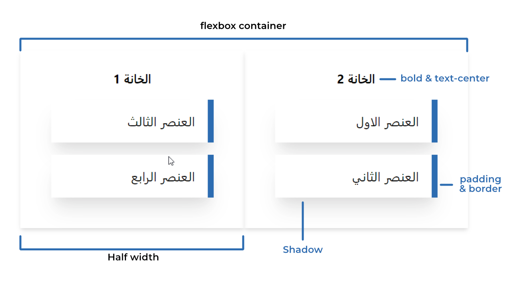

# <div dir="rtl">عن المشروع</div>

###### <div dir="rtl">هذا المشروع يهدف بالاساس لشرح كيفية جعل عناصر **React** قابلة للسحب و التحريك **(Drag & Drop)** عن طريق ما يسمى بـ **DOM Event Model** ما يعني أن هذا يتم مباشرة عن طريق [HTML Drag'n Drop API](https://developer.mozilla.org/en-US/docs/Web/API/HTML_Drag_and_Drop_API) دون اللجوء الى مكتبات خارجية.</div>

<br></br>

# <div dir="rtl">الهدف</div>

###### <div dir="rtl">يسرني أنك قد سئلت, هناك العديد من عناصر واجهة المستخدم (UI) التي يمكن ان تتحسن عندما نضيف لها خاصية التحريك, خصوصا بالنسبة للاجهزة التي تعمل باللمس. عموما نجد هذه العناصر في البرامج التعليمية على سبيل المثال او أي حلول تعتمد بشكل كبير على تجاوب المستخدم مع الواجهة. بعض الامثلة: [Trello Boards](https://trello.com/), [Google Calendar Scheduler](https://calendar.google.com/), [DrawMuzz](https://drawmuzz.web.app/)</div>

<br></br>

# <div dir="rtl">النتيجة النهائية</div>

###### <div dir="rtl">المشروع الذي سنقوم بصنعه:</div>


###### <div dir="rtl">مثال عن كيف يمكن استخدامه في مشروع حقيقي:</div>


###### <div dir="rtl">رابط للتجريب: [https://qalamar.github.io/react-dnd-showcase](https://qalamar.github.io/react-dnd-showcase)</div>

---
<br></br>

# <div dir="rtl">كيف يعمل المشروع</div>


---
<br></br>

# <div dir="rtl">متطلبات</div>

###### <div dir="rtl">للقيام بتشغيل وصنع المثال, نحتاج أولا الى تنفيذ بعض الاوامر:</div>

```javascript
npx create-react-app react-dnd
cd react-dnd
npm start
```

###### <div dir="rtl">اذا كنت تستعمل **Yarn**

</div>

```javascript
yarn create react-app react-dnd
cd react-dnd
yarn start
```

---
<br></br>

# <div dir="rtl">تعليمات</div>

###### <div dir="rtl">توجه الى ملف `App.js`</div>

##### <div dir="rtl">تخزين المعلومات:</div>

###### <div dir="rtl">لنقم بانشاء جدول يضم معلومات حول العناصر, هذه المعلومات تتظمن: معرف `id` , محتوى العنصر `item` والخانة الخاصة به `type`.</div>

```javascript
const [state, setState] = useState({
  items: [
    {
      id: "1",
      item: "العنصر الاول",
      type: "Slot1",
    },
    {
      id: "2",
      item: "العنصر الثاني",
      type: "Slot1",
    },
    {
      id: "3",
      item: "العنصر الثالث",
      type: "Slot2",
    },
    {
      id: "4",
      item: "العنصر الرابع",
      type: "Slot2",
    },
  ],
});
```

##### <div dir="rtl">معالجة التحريك (Event handlers):</div>

###### <div dir="rtl">حينما نضغط على العنصر عند بداية التحريك **(onDragStart)**, نقوم بتهيئة معلومات العنصر للنقل عن طريق `dataTransfer.setData`</div>

```javascript
const onDragStart = (event, item) => {
  event.dataTransfer.setData("item", item);
};
```

###### <div dir="rtl">نمنع المعالجة الافتراضية لأننا نريد تطبيق معالجة خاصة (مقارنة الخانات) عند نهاية التحريك **(onDragOver)**

</div>

```javascript
const onDragOver = (event) => {
  event.preventDefault();
};
```

###### <div dir="rtl">عند وضع العنصر داخل الاطار, نقوم بتحويل المعلومات المعدة سابقا في `dataTransfer.getData` ونقوم بالتأكد بأن العنصر في الاطار المناسب. بعدها نقوم بتحديث الـstate بالحالة الجديدة
</div>

###### <div dir="rtl">ونقوم بالتأكد بأن العنصر في الاطار المناسب. بعدها نقوم بتحديث الـstate بالحالة الجديدة</div>

```javascript
const onDrop = (event, slot) => {
  let item = event.dataTransfer.getData("item");
  let items = state.items.filter((task) => {
    if (task.item === item) {
      task.type = slot;
    }
    return task;
  });
  setState({
    ...state,
    items,
  });
};
```

###### <div dir="rtl">عند حدوث تحريك, نقوم بتحديث جداول الخانات في حالة اضافة عنصر جديد</div>

###### <div dir="rtl">`لا تنسى ان تضيف "dir="rtl الى عناصرك اذا كنت تستخدم اللغة العربية`</div>

```javascript
state.items.forEach((task) => {
  items[task.type].push(
    <div
      key={task.id}
      onDragStart={(event) => onDragStart(event, task.item)}
      draggable
      dir="rtl"
    >
      {task.item}
    </div>
  );
});
```

###### <div dir="rtl">في واجهة المستخدم, نقوم بصنع خانتين. كل منهما تعرض العناصر المطابقة لنوعها من جدول العناصر
</div>

```javascript
<div>
  <h1 dir="rtl">يمكنك سحب العناصر من خانة الى اخرى (Drag & Drop)</h1>
  <div>
    <div
      onDragOver={(event) => onDragOver(event)}
      onDrop={(event) => onDrop(event, "Slot1")}
    >
      <h2>الخانة 1</h2>
      {items.Slot1}
    </div>
    <div
      onDragOver={(event) => onDragOver(event)}
      onDrop={(event) => onDrop(event, "Slot2")}
    >
      <h2>الخانة 2</h2>
      {items.Slot2}
    </div>
  </div>
</div>
```

---

##### <div dir="rtl">الملف النهائي</div>

###### <div dir="rtl">حينما تنتهي من اتباع ما سبق, يصبح لديك الملف التالي:</div>

```javascript
const App = () => {
  const [state, setState] = useState({
    items: [
      {
        id: "1",
        item: "العنصر الاول",
        type: "Slot1",
      },
      {
        id: "2",
        item: "العنصر الثاني",
        type: "Slot1",
      },
      {
        id: "3",
        item: "العنصر الثالث",
        type: "Slot2",
      },
      {
        id: "4",
        item: "العنصر الرابع",
        type: "Slot2",
      },
    ],
  });
  const onDragStart = (event, item) => {
    event.dataTransfer.setData("item", item);
  };
  const onDragOver = (event) => {
    event.preventDefault();
  };

  const onDrop = (event, slot) => {
    let item = event.dataTransfer.getData("item");
    let items = state.items.filter((task) => {
      if (task.item === item) {
        task.type = slot;
      }
      return task;
    });
    setState({
      ...state,
      items,
    });
  };

  let items = {
    Slot1: [],
    Slot2: [],
  };

  state.items.forEach((task) => {
    items[task.type].push(
      <div
        key={task.id}
        onDragStart={(event) => onDragStart(event, task.item)}
        draggable
        dir="rtl"
      >
        {task.item}
      </div>
    );
  });

  return (
    <div>
      <h1 dir="rtl">يمكنك سحب العناصر من خانة الى اخرى (Drag & Drop)</h1>
      <div>
        <div
          onDragOver={(event) => onDragOver(event)}
          onDrop={(event) => onDrop(event, "Slot1")}
        >
          <h2>الخانة 1</h2>
          {items.Slot1}
        </div>
        <div
          onDragOver={(event) => onDragOver(event)}
          onDrop={(event) => onDrop(event, "Slot2")}
        >
          <h2>الخانة 2</h2>
          {items.Slot2}
        </div>
      </div>
    </div>
  );
};
```

---

##### <div dir="rtl">تنسيق</div>

###### <div dir="rtl">لجعل المشروع في صيغة قابلة للعرض, سنقوم باضافة `TailwindCSS` مما يمكننا من تعديل الواجهة بسهولة</div>

###### <div dir="rtl">`هذه الخطوة اختيارية ويمكنك استعمال CSS فقط أو اي مكتبة تفضل كـBootstrap, Material UI`</div>

##### <div dir="rtl">التعليمات</div>

```javascript
yarn add tailwindcss -D
npx tailwind init
```

###### <div dir="rtl">اصنع ملف `src/tailwind.css` وضع بداخله المعلومات التالية:</div>

```javascript
@tailwind base;
@tailwind components;
@tailwind utilities;
```

###### <div dir="rtl">الان توجه الى ملف `package.json` وعدل الـscripts كما يلي:</div>

```javascript
"scripts": {
  "start": "npm run tailwind:css && react-scripts start",
  "tailwind:css": "tailwind build src/tailwind.css -c tailwind.config.js -o src/index.css",
  "build": "npm run tailwind:css && react-scripts build",
  ...
}
```

###### <div dir="rtl">عد الى الملف الرئيسي وطبق التنسيق التالي:</div>

```javascript
const App = () => {
  const [state, setState] = useState({
    items: [
      {
        id: "1",
        item: "العنصر الاول",
        type: "Slot1",
      },
      {
        id: "2",
        item: "العنصر الثاني",
        type: "Slot1",
      },
      {
        id: "3",
        item: "العنصر الثالث",
        type: "Slot2",
      },
      {
        id: "4",
        item: "العنصر الرابع",
        type: "Slot2",
      },
    ],
  });
  const onDragStart = (event, item) => {
    event.dataTransfer.setData("item", item);
  };
  const onDragOver = (event) => {
    event.preventDefault();
  };

  const onDrop = (event, slot) => {
    let item = event.dataTransfer.getData("item");
    let items = state.items.filter((task) => {
      if (task.item === item) {
        task.type = slot;
      }
      return task;
    });
    setState({
      ...state,
      items,
    });
  };

  let items = {
    Slot1: [],
    Slot2: [],
  };

  state.items.forEach((task) => {
    items[task.type].push(
      <div
        key={task.id}
        onDragStart={(event) => onDragStart(event, task.item)}
        draggable
        dir="rtl"
        className="p-4 m-4 bg-white border-r-8 border-blue-700 shadow-xl"
      >
        {task.item}
      </div>
    );
  });

  return (
    <div className="flex flex-wrap pt-32 main">
      <div class="md:w-3/12 w-1/12 p-4"></div>
      <div class="md:w-6/12 w-10/12 p-4">
        <h1 className="pb-16 text-xl font-bold text-center" dir="rtl">
          يمكنك سحب العناصر من خانة الى اخرى (Drag & Drop)
        </h1>
        <div className="flex flex-wrap">
          <div
            className="w-1/2 p-6 shadow-md"
            onDragOver={(event) => onDragOver(event)}
            onDrop={(event) => {
              onDrop(event, "Slot1");
            }}
          >
            <h2 className="font-bold text-center">الخانة 1</h2>
            {items.Slot1}
          </div>
          <div
            className="w-1/2 p-6 shadow-md"
            onDragOver={(event) => onDragOver(event)}
            onDrop={(event) => onDrop(event, "Slot2")}
          >
            <h2 className="font-bold text-center">الخانة 2</h2>
            {items.Slot2}
          </div>
        </div>
      </div>
      <div class="md:w-3/12 w-1/12 p-4"></div>
    </div>
  );
};
```
###### <div dir="rtl">هذا التنسيق يسمح لنا بالحصول على الواجهة التالية</div>



###### <div dir="rtl">الان بامكانك تشغيل المشروع</div>

```javascript
  yarn run start
```

---
<br></br>

# <div dir="rtl">ماذا بعد؟</div>

###### <div dir="rtl">اذا كنت تريد أن تطور حلول اكثر تعقيدا او أن تظيف Animations دون أن تصنع كل شيء يديويا, انصحك بالاضافات مفتوحة المصدر التالية:</div>

###### <div dir="rtl">- [React Beautiful DnD](https://github.com/atlassian/react-beautiful-dnd)</div>

###### <div dir="rtl">- [React DnD](https://github.com/react-dnd/react-dnd/)</div>

###### <div dir="rtl">- [React Trello](https://github.com/rcdexta/react-trello)</div>

###### <div dir="rtl">سبب اختياري لهذه الاضافات هو لكونها مشهورة نسبيا وتحظى بدعم مستمر من المطورين. أود أيضا أن اذكر بعض المكتبات مثل [Framer Motion](https://www.framer.com/motion) التي تحتوي على خصائص مشابهة</div>

# <div dir="rtl">كلمة أخيرة</div>

###### <div dir="rtl">شكرا على القراءة حتى هذه النقطة, أتمنى ان يكون الشرح مفيدا وحظا سعيدا في مشاريعكم المقبلة.
</div>
